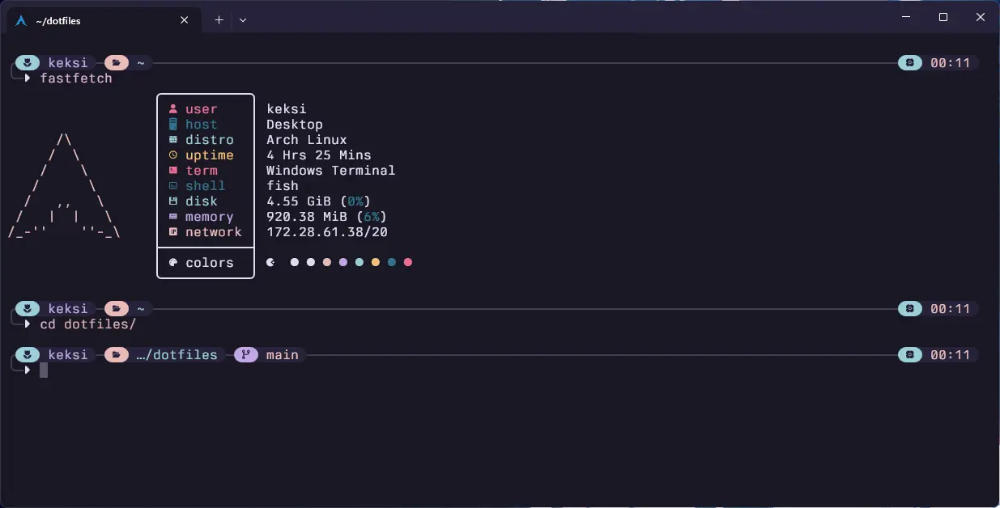

<h1 align="center"><i>/home/keksi/.config</i></h1>

<p align="center">
  
  
  
</p>

---

<p align="center"><samp>Preview</samp></p>

<p align="center">
  
</p>

<p align="center">
  <sub>
    <samp>
      &nbsp;&nbsp;&nbsp;&nbsp;&nbspTheme | <a href="https://rosepinetheme.com/">Rosé Pine</a><br>
      &nbsp;&nbsp;&nbsp;&nbsp;&nbsp;&nbsp;&nbsp;&nbsp;&nbsp;&nbsp;Font | <a href="https://usgraphics.com/products/berkeley-mono">Berkeley Mono</a><br>
      Shell | <a href="https://fishshell.com/">Fish</a><br>
      &nbsp;&nbsp;&nbsp;&nbsp;&nbsp;&nbsp;&nbsp;&nbsp;&nbsp;Prompt | <a href="https://starship.rs/">Starship</a>&nbsp;&nbsp;&nbsp;&nbsp;&nbsp;&nbsp;
    </samp>
  </sub>
</p>

### Requirements

1. Update system packages

```bash
sudo apt update && sudo apt upgrade -y
```

2. Install curl

```bash
sudo apt install -y curl
```

3. (Optional) Enable passwordless sudo
   This allows a user to run `sudo` commands without being prompted for a password.  
   **Warning:** This reduces system security and should only be used in trusted environments.  

```bash
read -p "Enter the username to grant passwordless sudo: " USER && \
sudo usermod -aG sudo "$USER" && \
echo "$USER ALL=(ALL) NOPASSWD:ALL" | sudo tee /etc/sudoers.d/"$USER" > /dev/null && \
sudo chmod 440 /etc/sudoers.d/"$USER" && \
echo "✅ User '$USER' can now use sudo without a password."
```

### Installation

1. Install Nala (optional, improves apt UX)

```bash
curl https://gitlab.com/volian/volian-archive/-/raw/main/install-nala.sh | bash
sudo apt install -y nala
```

2. Base packages

```bash
sudo nala install -y git gh wget curl stow fish gpg starship fastfetch btop bat eza zoxide git-delta
```

3. Clone and stow

```bash
git clone https://github.com/keksiqc/dotfiles ~/.dotfiles
cd ~/.dotfiles
stow -v --target="$HOME" .
```

4. Make Fish your default shell

```bash
chsh -s /usr/bin/fish
```

5. Login to GitHub CLI

```bash
gh auth login -s write:gpg_key
```

6. Run GPG script

```bash
chmod +x ./scripts/create_gpg_key.sh && ./scripts/create_gpg_key.sh
```

Then log out and back in.

### Optional tools

- Atuin (history sync)

```bash
curl --proto '=https' --tlsv1.2 -LsSf https://setup.atuin.sh | sh
```

- Mise (runtime manager)

```bash
curl https://mise.run | sh
```

- Fisher (Fish plugin manager)

```bash
curl -sL https://raw.githubusercontent.com/jorgebucaran/fisher/main/functions/fisher.fish | source
fisher install jorgebucaran/fisher
```

- PNPM ni helpers

```bash
pnpm -g i @antfu/ni
```

## Updating

```bash
cd ~/.dotfiles
git pull
stow -v --target="$HOME" .
```

To remove symlinks:

```bash
stow -v -D --target="$HOME" .
```

### Notes on security

Some steps use curl | sh for convenience. Review scripts before running if
unsure.

### License

MIT — see [LICENSE](./LICENSE).
