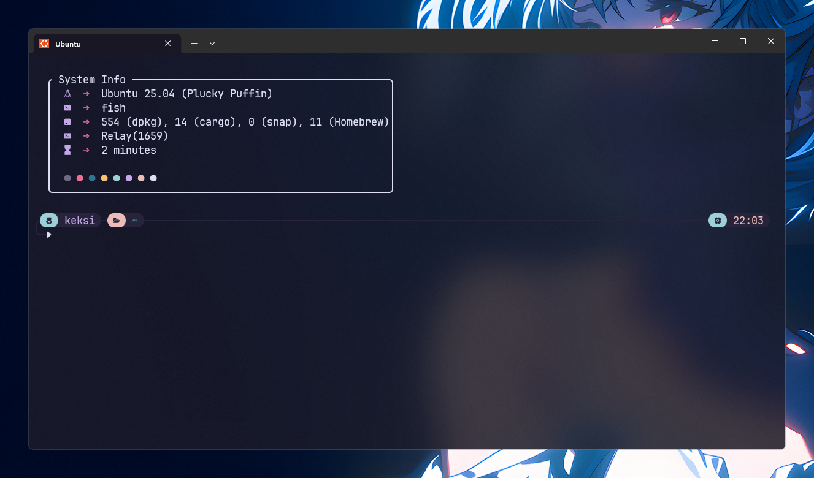

<h1 align="center"><i>/home/keksi/.config</i></h1>

<p align="center">
  
  
  
</p>

---

<p align="center"><samp>Preview</samp></p>

<p align="center">
  
</p>

<p align="center">
  <sub>
    <samp>
      &nbsp;&nbsp;&nbsp;&nbsp;&nbspTheme | <a href="https://rosepinetheme.com/">Rosé Pine</a><br>
      &nbsp;&nbsp;&nbsp;&nbsp;&nbsp;&nbsp;&nbsp;&nbsp;&nbsp;&nbsp;Font | <a href="https://usgraphics.com/products/berkeley-mono">Berkeley Mono</a><br>
      Shell | <a href="https://fishshell.com/">Fish</a><br>
      &nbsp;&nbsp;&nbsp;&nbsp;&nbsp;&nbsp;&nbsp;&nbsp;&nbsp;Prompt | <a href="https://starship.rs/">Starship</a>&nbsp;&nbsp;&nbsp;&nbsp;&nbsp;&nbsp;
    </samp>
  </sub>
</p>

### Requirements

1. Update system packages

```bash
sudo apt update && sudo apt upgrade -y
```

2. Install git

```bash
sudo apt install -y git
```

### Installation

```bash
git clone https://github.com/keksiqc/dotfiles ~/.dotfiles
~/.dotfiles/bin/dot install
```

This will guide you through:

- Installing essential packages (git, fish, starship, stow, etc.)
- Symlinking configs via stow
- Optional tools (atuin, mise, fisher, ni)
- Changing default shell to fish
- GitHub CLI login
- GPG signing key setup

### The `dot` command

After installation, `dot` is available in your PATH:

```
dot                  Interactive menu
dot install          Full setup
dot install stow     Re-symlink configs only
dot install packages Install essential packages only
dot install tools    Install optional tools only
dot install shell    Change default shell to fish
dot install gh       Login to GitHub CLI
dot install gpg      Setup GPG signing key
dot update           Pull latest changes and re-stow
dot remove           Remove all dotfile symlinks
```

### Updating

```bash
dot update
```

### Notes on security

Some steps use curl | sh for convenience. Review scripts before running if
unsure.

### License

MIT — see [LICENSE](./LICENSE).
