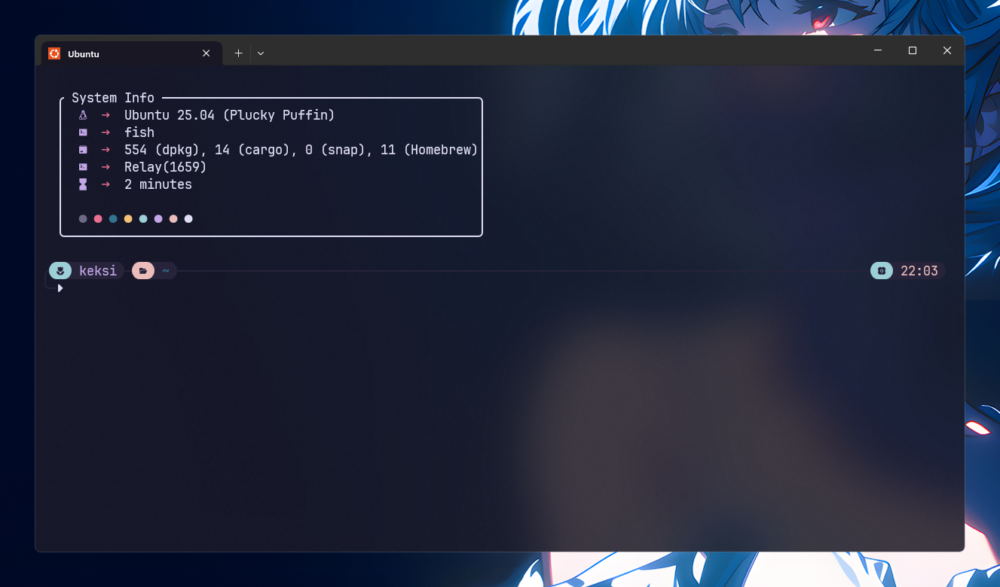

<h1 align="center"><i>/home/keksi/.config</i></h1>

<p align="center">
  
  
  
</p>

---

<p align="center"><samp>Preview</samp></p>

<p align="center">
  
</p>

<p align="center">
  <sub>
    <samp>
      &nbsp;&nbsp;&nbsp;&nbsp;&nbspTheme | <a href="https://rosepinetheme.com/">Rosé Pine</a><br>
      &nbsp;&nbsp;&nbsp;&nbsp;&nbsp;&nbsp;&nbsp;&nbsp;&nbsp;&nbsp;Font | <a href="https://usgraphics.com/products/berkeley-mono">Berkeley Mono</a><br>
      Shell | <a href="https://fishshell.com/">Fish</a><br>
      &nbsp;&nbsp;&nbsp;&nbsp;&nbsp;&nbsp;&nbsp;&nbsp;&nbsp;Prompt | <a href="https://starship.rs/">Starship</a>&nbsp;&nbsp;&nbsp;&nbsp;&nbsp;&nbsp;
    </samp>
  </sub>
</p>

### Requirements

1. Update system packages

```bash
sudo apt update && sudo apt upgrade -y
```

2. Install git (Python 3.11+ is already part of Ubuntu 24.04 and newer)

```bash
sudo apt install -y git
```

### Installation

```bash
git clone https://github.com/keksiqc/dotfiles ~/.dotfiles && ~/.dotfiles/install
```

This runs [`bin/dot`](./bin/dot) with [`dot.toml`](./dot.toml), which:

- Removes dead symlinks in `~` that point into this repo
- Symlinks the configs under `.config/`
- Sets up passwordless sudo
- Installs apt prerequisites and adds the fish PPA
- Installs mise and the tools in `.config/mise`
- Installs fisher and fish plugins
- Logs in to the GitHub CLI and sets up GPG commit signing
- Logs in to Proton Pass and loads SSH keys

Useful flags (all in `./install --help`):

```bash
./install -n              # dry run: show what would change
./install --only link     # run only some steps
./install --skip shell    # run everything except some steps
./install --list          # show steps and loaded plugins
```

### dot

`dot` is a dependency-free replacement for [dotbot](https://github.com/anishathalye/dotbot) that reads
a TOML file. It needs nothing but Python 3.11+ (for the built-in TOML parser) and is laid out like dotbot:

```
bin/dot            launcher (also: python3 -m dot from the repo root)
dot/cli.py         argument parsing and the step runner
dot/context.py     the ctx object handed to plugins
dot/plugin.py      plugin registry and config helpers
dot/plugins/       built-in plugins, one file each
```

#### Config

Every top-level table (or key) in `dot.toml` is a **step**, handled by the plugin of the same name.
Steps run in the order they appear in the file. `[dot]` and `[defaults]` are settings, not steps.
To run a plugin twice, add a suffix to the step name: `[apt]` and `[apt-fish]` are both handled by `apt`.

```toml
[dot]
plugins = ["plugins"]         # extra plugin files or directories (relative to the repo)

[defaults.link]               # default options for every entry of a plugin
create = true
relink = true

clean = ["~", "~/.config"]    # remove dead symlinks that point into this repo
create = ["~/i", "~/.ssh"]    # create directories

[link]
"~/.config/bat" = true        # true = same path inside the repo (.config/bat)
"~/.vimrc" = "vim/vimrc"      # explicit source, relative to the repo
"~/.config/nvim" = { path = "nvim", if = "command -v nvim" }
"~/.config" = { path = "config/*", glob = true, exclude = ["config/private*"] }

[sudo]
nopasswd = true               # /etc/sudoers.d/<user>-nopasswd, validated with visudo

[apt]
update = true                 # apt-get update before installing what is missing
packages = ["curl", "git"]

[ppa]
repos = ["fish-shell/release-4"]

[apt-fish]                    # same plugin, later in the run
packages = ["fish"]

[user]
shell = "fish"                # login shell (chsh), added to /etc/shells if needed
groups = ["docker"]           # usermod -aG

[[shell]]
run = "scripts/mise.sh"
desc = "Install mise and packages"
if = "command -v curl"        # skip when this shell condition fails
```

| Plugin   | Entry options                                                                                                                                                                          |
| -------- | -------------------------------------------------------------------------------------------------------------------------------------------------------------------------------------- |
| `link`   | `path`, `create` (parent dirs), `relink` (replace other symlinks), `force` (replace files/dirs), `if`, `glob`, `exclude`, `relative`, `ignore-missing`, `canonicalize` (default `true`) |
| `create` | `mode` (e.g. `0o700`)                                                                                                                                                                  |
| `clean`  | `force` (remove every dead symlink, not only ones into this repo), `recursive`                                                                                                          |
| `shell`  | `run` (or `command`), `desc`, `if`, `quiet`, `stdin`/`stdout`/`stderr` (default `true`), `cwd`, `env`                                                                                  |
| `apt`    | `packages`, `update`, `no-recommends`; skips packages dpkg already has                                                                                                                 |
| `ppa`    | `repos`, `update` (default `true`); installs `software-properties-common` if needed, skips PPAs already under `/etc/apt`                                                              |
| `sudo`   | `nopasswd` (default `true`), `user`; refuses to overwrite a differing sudoers file                                                                                                     |
| `user`   | `shell`, `groups`, `name`                                                                                                                                                              |

`clean`, `create`, `apt` and `ppa` also accept a plain list (`apt = ["curl"]`), and `shell` a plain string.
Commands run in the repo directory with `DOT_BASE_DIR` and `DOT_DRY_RUN` set, and get `sudo` prefixed
unless dot already runs as root. A failing step stops the run (exit code 1) unless you pass `-k`;
a broken config exits with 2.

#### Plugins

A plugin is a Python file that registers a handler for a step name, exactly like the built-ins in
[`dot/plugins/`](./dot/plugins). Point `[dot] plugins` at the file (or a directory of files), or pass
`--plugin FILE` / `--plugin-dir DIR`.

```python
# plugins/brew.py
import dot


@dot.plugin("brew")
def brew(ctx, data):
    """brew = ["ripgrep", "jq"]  or  [brew] packages = [...]"""
    packages, options = dot.listing(data, "packages", "brew")
    _, installed = ctx.capture("brew list --formula")
    missing = [p for p in packages if p not in installed.split()]
    if not missing:
        ctx.log.skip("all brew packages are installed")
        return True
    ctx.log.info("installing " + " ".join(missing))
    if ctx.dry_run:
        return True
    return ctx.run("brew install " + " ".join(missing)) == 0
```

The handler receives the raw TOML value of the step and returns `True` or `False`. Raise `dot.ConfigError`
for a malformed step; `dot.listing`, `dot.entries` and `dot.normalize` parse the common shapes.
The `ctx` object gives you:

- `ctx.base_dir`, `ctx.home`, `ctx.user`, `ctx.is_root`, `ctx.dry_run`, `ctx.config`
- `ctx.defaults("brew")` for the `[defaults.brew]` table
- `ctx.source(path)` and `ctx.target(path)` to resolve paths against the repo or `~`, `ctx.pretty(path)` for output
- `ctx.run(cmd, ...)`, `ctx.capture(cmd)`, `ctx.check(condition)`, `ctx.which(cmd)`, `ctx.sudo(cmd)`
- `ctx.remove(path)`, `ctx.mkdir(path)`, `ctx.symlink(src, dst)`, which all respect `--dry-run`
- `ctx.log.info / ok / skip / warn / error / debug`

### Notes on security

Some steps use curl | sh for convenience. Review scripts before running if
unsure.

### License

MIT — see [LICENSE](./LICENSE).
