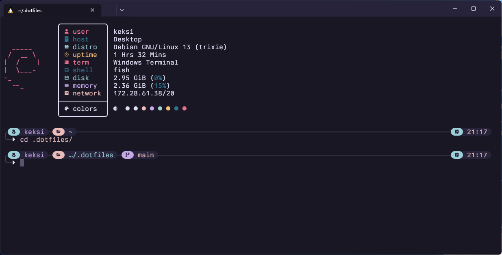

<h1 align="center"><i>/home/keksi/.config</i></h1>

  

  
  
  

---

<samp>Preview</samp>

  

---

  
    <samp>
      &nbsp;&nbsp;&nbsp;&nbsp;&nbspTheme | <a href="https://rosepinetheme.com/">Rosé Pine</a> 
      &nbsp;&nbsp;&nbsp;&nbsp;&nbsp;&nbsp;&nbsp;&nbsp;&nbsp;&nbsp;Font | <a href="https://usgraphics.com/products/berkeley-mono">Berkeley Mono</a> 
      Shell | <a href="https://fishshell.com/">Fish</a> 
      &nbsp;&nbsp;&nbsp;&nbsp;&nbsp;&nbsp;&nbsp;&nbsp;&nbsp;Prompt | <a href="https://starship.rs/">Starship</a>&nbsp;&nbsp;&nbsp;&nbsp;&nbsp;&nbsp;
    </samp>
  

## LICENSE

MIT
